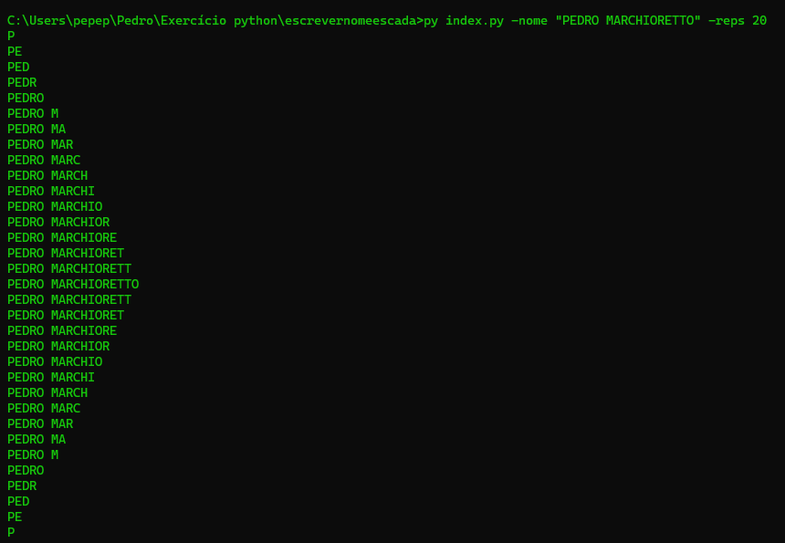
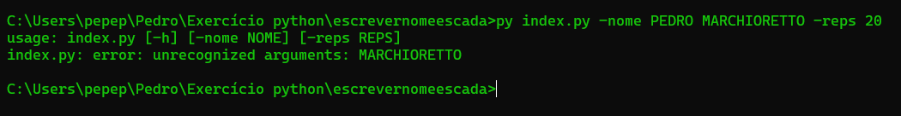
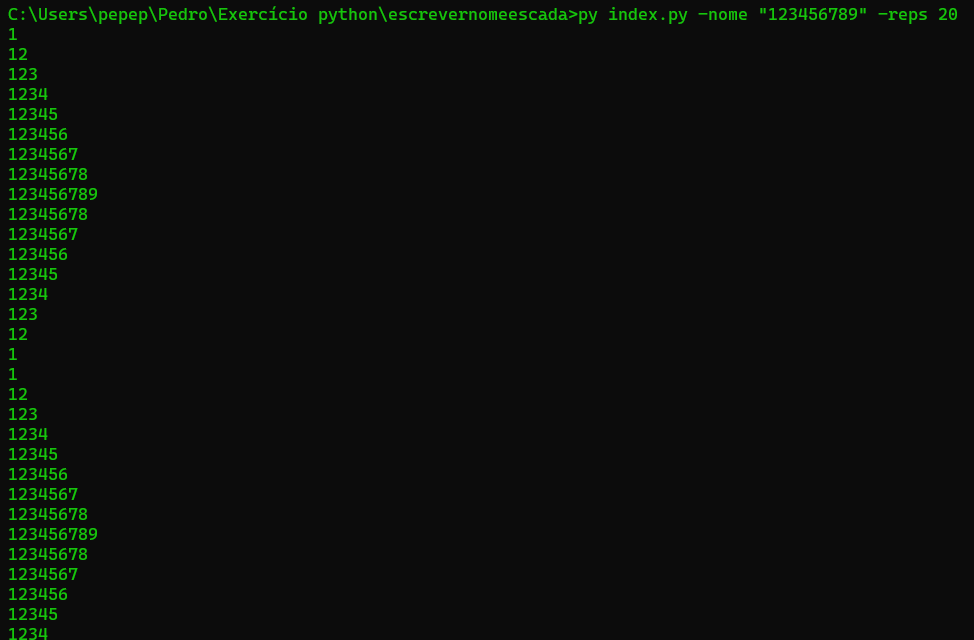
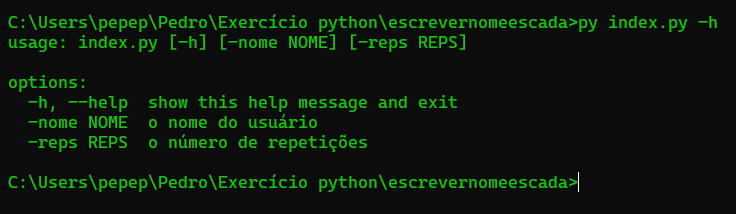

# Exercício em python 🐍

#### Para treinar programação e lógica em python, criei um script em python que escreve uma string determinada pelo usuário em formato de escada 


### Execução do código: 
* Antes de executar o código, lembre-se que é necessário instalar o `python` no seu computador. 
Caso você ainda não possua, clique [aqui](https://www.python.org/) para fazer o download. 

* Após instalar o python, abra o `Prompt de Comando` ou o terminal do `vscode`.

* Já dentro da pasta da qual o script está localizado

~~~
py index.py -nome "STRING DE SEU INTERESSE" -reps 10 (quantas vezes você quer repetir o processo) 
~~~

* Lembre-se de colocar a string de seu interesse entre aspas para evitar erros 
  

* Você também pode utilizar números ao invés de caracteres para executar o código
  


# Ajuda
Caso a execução do código não ocorra corretamente ou você se esqueça de como executá-lo, use a aba de ajuda.

```
py index.py -h
```
Você verá uma tela como essa:



Caso tenha ideias para otimização e melhora do código, faça uma pull request 😄
